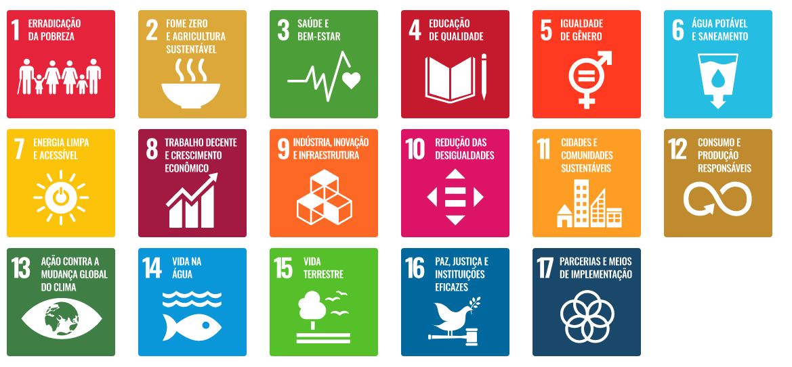
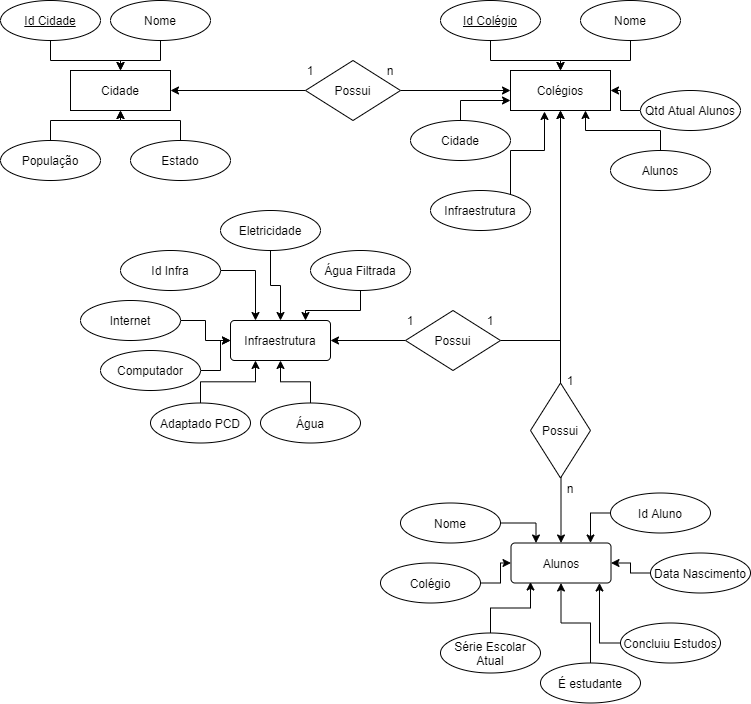

## Relação entre infraestrutura escolar e evasão escolar

API baseado em um dos 17 objetivos de desenvolvimento sustentável da ONU

Os Objetivos de Desenvolvimento Sustentável são um apelo global à ação para acabar com 
a pobreza, proteger o meio ambiente e o clima e garantir que as pessoas, em todos os 
lugares, possam desfrutar de paz e de prosperidade. Estes são os objetivos para os 
quais as Nações Unidas estão contribuindo a fim de que possamos atingir a Agenda 2030 
no Brasil.

